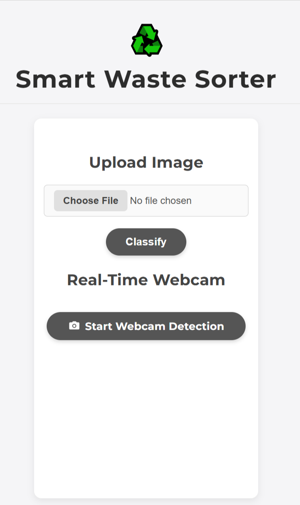
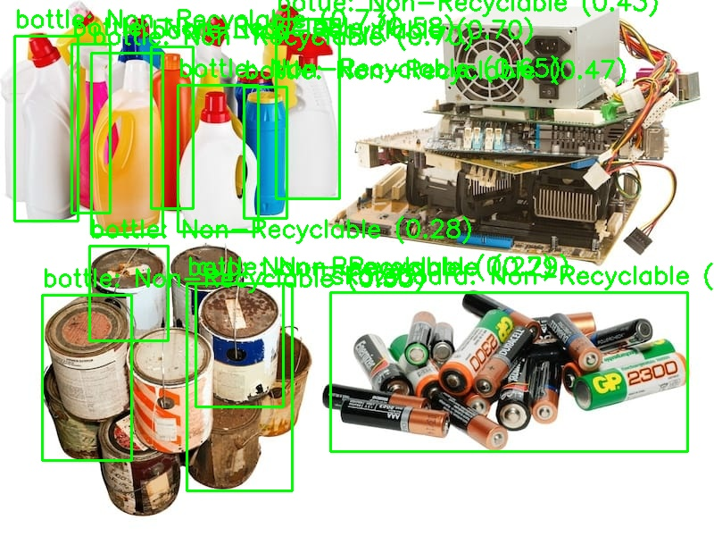
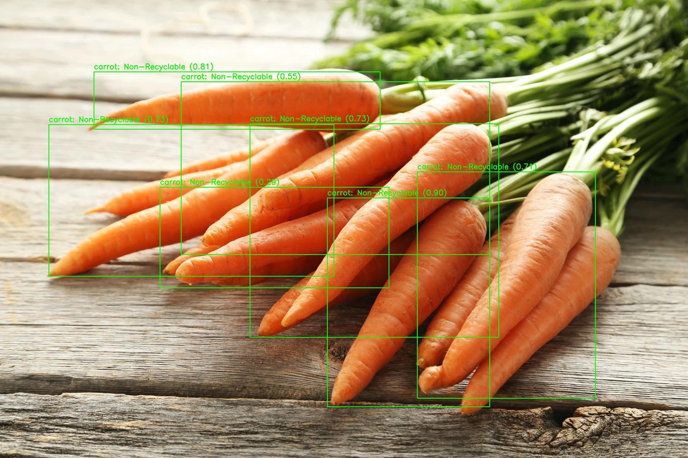
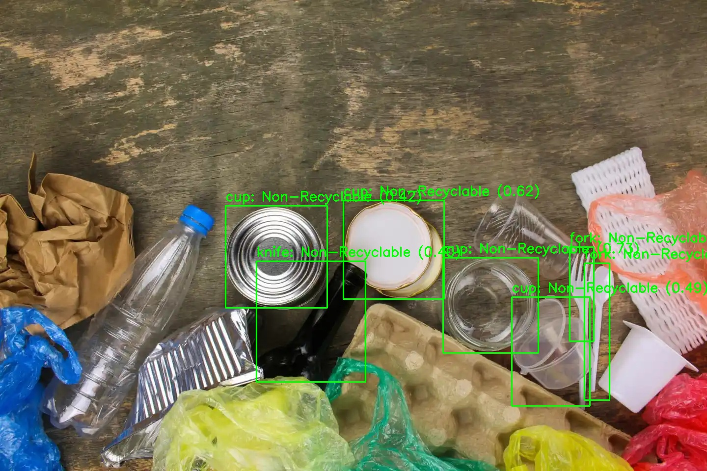
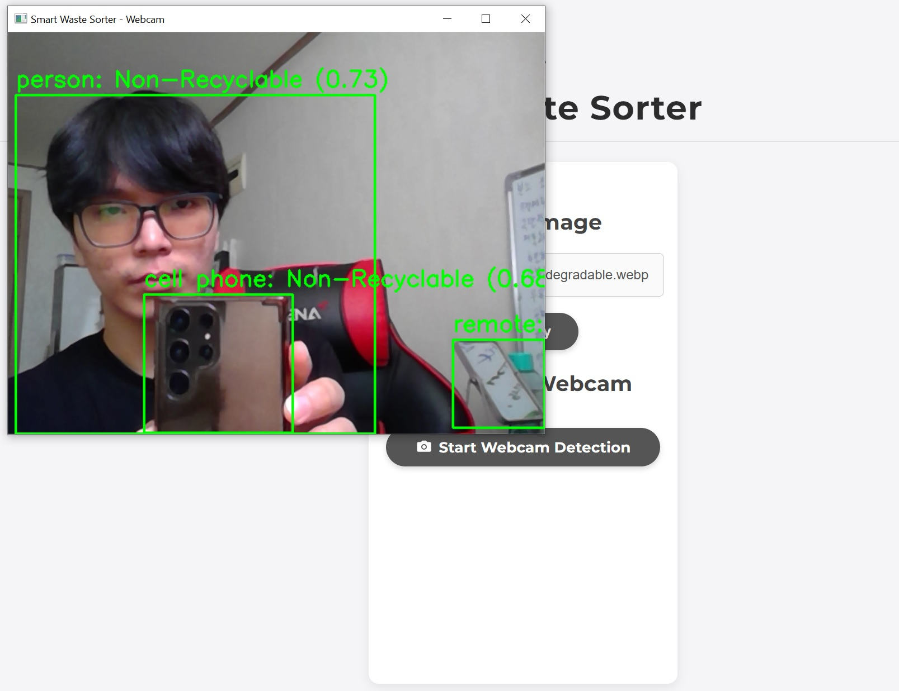

<div style="display: flex; align-items: center; gap: 10px; justify-content: space-between;">
   <h1>Smart Waste Sorter</h1>
    
</div>

## Overview

Classifies waste items in a photo or webcam feed as recyclable (e.g., plastic, paper) or non-recyclable (e.g., food waste) using YOLOv5 and OpenCV. Auto-saves classified images in `output/`.

## Features

- Upload images via web interface to classify waste.
- Real-time webcam detection (press ‘s’ to save, ‘q’ to quit).
- Auto-saves uploaded images (`upload_[timestamp].jpg`) and classified images (`classified_[timestamp].jpg`, `webcam_[timestamp].jpg`).

## Requirements

- Python 3.8+, `opencv-python`, `torch`, `torchvision`, `flask`
- Laptop with optional webcam

## Installation

1. Clone repo:

   ```bash
   git clone https://github.com/yourusername/smart-waste-sorter.git
   cd smart-waste-sorter
   ```
2. Install dependencies:

   ```bash
   pip install opencv-python torch torchvision flask
   ```

## Usage

1. Run:

   ```bash
   python app.py
   ```
2. Open `http://localhost:5000`, upload an image, or click “Start Webcam Detection”.
3. Output: Images auto-saved in `output/` (e.g., `classified_20250608_1326.jpg`).

## Demo

<div style="display: flex; gap: 15px;">
    
    
    
    
</div>

## Reference
- YOLOv5: Ultralytics
- OpenCV: Docs
- Flask: Docs

## License

MIT License (see LICENSE).

## Contributions

[Temuulen(21102460)\]
